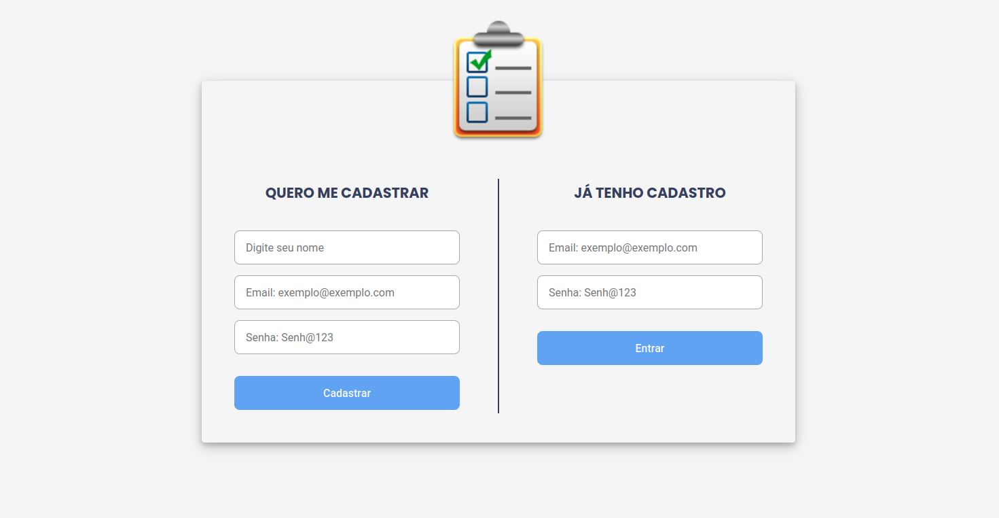
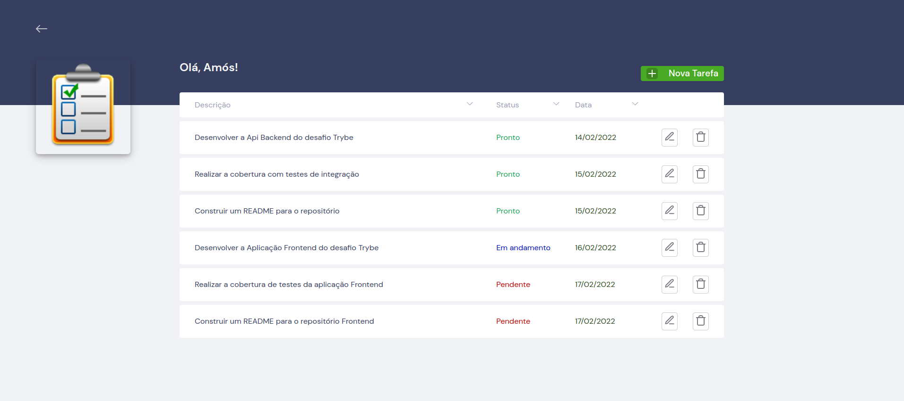

    
  <h1>
    Boas vindas ao repositório do projeto "Tasks Manager - Frontend"! 🚀
  </h1>

  <a href="#tecnologias">Tecnologias</a>&nbsp;&nbsp;&nbsp;|&nbsp;&nbsp;&nbsp;
  <a href="#projeto">Projeto</a>&nbsp;&nbsp;&nbsp;|&nbsp;&nbsp;&nbsp;
  <a href="#instruções">Instruções</a>&nbsp;&nbsp;&nbsp;|&nbsp;&nbsp;&nbsp;
  <a href="#contato">Contato</a>

 

[**Layout - Interface**](https://tasksmanager-frontend.vercel.app/)

    
    

 

---

<h1 id="tecnologias">Tecnologias ✅</h1>

 

Esse projeto foi desenvolvido com as seguintes tecnologias:

- HTML
- CSS
- JavaScript
- React

 

---

<h1 id="projeto">Projeto ✅</h1>

 

Neste projeto é possivél que usuário possa:

- Fazer seu cadastro de usuário com nome, email e senha;

- Efetuar o login com o email e senha cadastrados;

- Visualizar a lista de tarefas contendo sua descrição, status e data;

- Ordernar tarefas pelo nome, status ou data;

- Adicionar, editar, e remover uma tarefa na lista;

- Fazer logout

Sobre o desenvolvimento:

- Utilização do contextApi para gerencimento de estado;

- Arquitetura seguindo os princípios SOLID;

- Deploy na plataforma [Vercel](https://vercel.com/) sincronizado com GitHub.

- Estilização dos componentes utilizando a lib [styled components](https://styled-components.com/).

- Utilização do [ESLint](https://eslint.org/) apenas como plugin no vscode para padronização de ecrita do código.

[Backend:](https://github.com/amosrodrigues/api-tasks-manager)

- Api hospedada na plataforma do [Heroku](https://www.heroku.com).

- Banco de dados hospedado no [MongoDB Atlas](https://www.mongodb.com/) com servidor da AWS.

 

---

<h1 id="instruções">Instruções ✅</h1>

 

### Para instalação

1. Clone o repositório

- `git@github.com:Amos-Rodrigues-Dev/tasksmanager-frontend.git`.
  - Entre na pasta do repositório que você acabou de clonar:
  - `tasksmanager-frontend.git`

2. Instale as dependências já contidas no arquivo `package.json`.

- `yarn install`

3. Crie uma branch a partir da branch `main` conforme preferir.

4. Rode os senguinte comando para iniciar a aplicação: 🎲

- `yarn start`

### Sobre os testes

- Estão em produção utilizando RTL.

  - Atualmente esta aplicação é testada e validada pelo backend com 97.13% de cobertura.

 

---

<h1 id="contato">Contato ✅</h1>

 

<h1>
  
</h1>

 
  
   

 

Espero que tenha curtido! 💜
